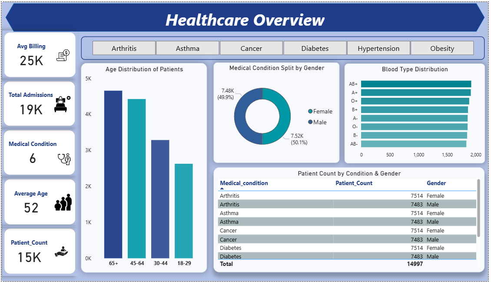
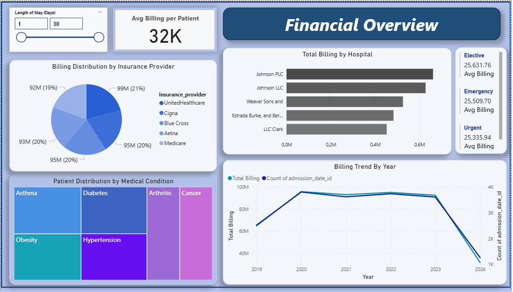
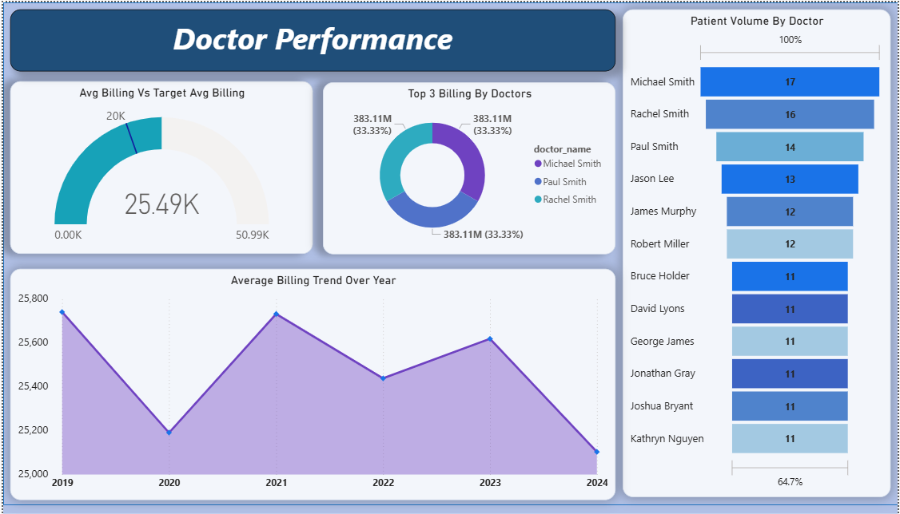

🏥 Healthcare Analytics Dashboard – Power BI Project
📌 Project Overview

This project focuses on building an interactive Healthcare Analytics Dashboard using Power BI to analyze patient demographics, hospital financial performance, and doctor efficiency.
The goal is to transform raw healthcare data into meaningful insights that support data-driven decision-making.

🎯 Objectives

Analyze patient demographics such as age, gender, and medical conditions

Track hospital financial performance including billing trends and insurance impact

Evaluate doctor performance based on patient load and revenue contribution

Build clean, interactive dashboards using DAX measures and calculated columns

📂 Dataset Information

The dataset contains healthcare admission records from the USA, including:

Patient Details: Age, Gender, Blood Type

Medical Info: Medical Condition, Admission Type, Test Results

Hospital Info: Hospital Name, Doctor Name, Room Number

Financial Data: Billing Amount, Insurance Provider

Date Fields: Admission Date, Discharge Date

🏗 Data Modeling

A star schema was implemented for efficient analysis:

Fact Table: fact_admissions

Dimension Tables:

dim_patient

dim_doctor

dim_hospital

dim_insurance

dim_date

Relationships were created using primary and foreign keys to support accurate aggregation.

🧮 Key DAX Measures & Calculations

Total Admissions

Patient Count

Total Billing

Average Billing

Average Billing per Patient

Average Age

Length of Stay (Calculated Column)

Age Group Classification (Young, Adult, Older)

📊 Dashboards Created
1️⃣ Patient Demographics Dashboard

KPI cards: Patient Count, Average Age, Medical Conditions

Age Group Distribution

Gender-wise Medical Condition Analysis

Blood Type Distribution

Condition-wise Patient Summary

Insights:
Helps understand patient profile, dominant age groups, and common medical conditions.

2️⃣ Financial Dashboard

Total & Average Billing KPIs

Billing Trend by Year

Billing by Hospital & Insurance Provider

Admission Type Analysis

Medical Condition vs Billing (Treemap)

Insights:
Identifies top revenue contributors, billing trends over time, and insurance impact.

3️⃣ Doctor Performance Dashboard

Gauge chart: Average Billing vs Target

Donut chart: Billing Contribution by Doctor

Area chart: Year-wise Average Billing

Funnel chart: Patient Count per Doctor

Insights:
Evaluates doctor workload, revenue performance, and contribution to hospital operations.

🛠 Tools & Technologies

Power BI

DAX

SQL (MySQL)

Data Modeling (Star Schema)

Data Visualization

✅ Key Outcomes

Built an end-to-end healthcare BI solution

Gained hands-on experience in DAX and Power BI modeling

Developed insights into healthcare operations and financial performance

Created professional dashboards suitable for business stakeholders

## 📸 Dashboard Screenshots

### Patient Demographics Dashboard

### Financial Dashboard

### Doctor Performance Dashboard

📌 Conclusion

This project demonstrates how healthcare data can be effectively analyzed using Power BI to uncover trends, monitor performance, and support strategic decisions.
It showcases strong skills in data analytics, visualization, and business intelligence.

📎 Author

Muthulaxmi  Lakhani

Aspiring Data Analyst | Power BI | SQL | Python
